# Казанцев Иван ИТ-4 Лабораторная №1

# Задание 1

## Задача 1

### Текст задачи

Дана сигнатура метода: public double fraction (double x);

Необходимо реализовать метод таким образом, чтобы он возвращал только дробную часть числа х. Подсказка: вещественное число может быть преобразовано к целому путем отбрасывания дробной части.

Пример:

x=5,25

результат: 0,25

### Алгоритм решения

1. Получить вещественное число x.
2. Преобразовать x к целому путем отбрасывания дробной части.
3. Вычесть полученное целое значение из исходного числа.
4. Вернуть полученный результат.

### Тестирование

## Задача 3

### Текст задачи

Дана сигнатура метода: public int charToNum (char x);

Метод принимает символ х, который представляет собой один из “0 1 2 3 4 5 6 7 8 9”. Необходимо реализовать метод таким образом, чтобы он преобразовывал символ в соответствующее число. Подсказка: код символа ‘0’ — это число 48.

Пример:

x=’3’

результат: 3

### Алгоритм решения

1. Получить символ x.
2. Вычесть из кода символа x код символа ‘0’.
3. Полученное значение преобразовать в число.
4. Вернуть результат.

### Тестирование

---

## Задача 5

### Текст задачи

Дана сигнатура метода: public bool is2Digits (int x);

Необходимо реализовать метод таким образом, чтобы он принимал число x и возвращал true, если оно двузначное.

Пример 1:

x=32

результат: true

Пример 2:

x=516

результат: false

### Алгоритм решения

1. Получить число x.
2. Проверить, является ли число двузначным.
3. Учесть положительные и отрицательные двузначные числа.
4. Если число двузначное, вернуть true.
5. В противном случае вернуть false.

### Тестирование

---

## Задача 7

### Текст задачи

Дана сигнатура метода: public bool isInRange (int a, int b, int num);

Метод принимает левую и правую границу (a и b) некоторого числового диапазона. Необходимо реализовать метод таким образом, чтобы он возвращал true, если num входит в указанный диапазон (включая границы). Обратите внимание, что отношение a и b заранее неизвестно (неясно кто из них больше, а кто меньше).

Пример 1:

a=5 b=1 num=3

результат: true

Пример 2:

a=2 b=15 num=33

результат: false

### Алгоритм решения

1. Получить значения a, b и num.
2. Определить границы диапазона независимо от их порядка.
3. Проверить, входит ли num в диапазон, включая границы.
4. Если входит, вернуть true.
5. В противном случае вернуть false.

### Тестирование

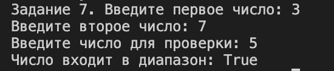

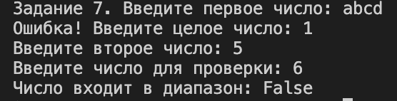

---

## Задача 9

### Текст задачи

Дана сигнатура метода: public bool isEqual(int a, int b, int c);

Необходимо реализовать метод таким образом, чтобы он возвращал true, если все три полученных методом числа равны.

Пример 1:

a=3 b=3 с=3

результат: true

Пример 2:

a=2 b=15 с=2

результат: false

### Алгоритм решения

1. Получить три числа a, b и c.
2. Сравнить a и b.
3. Сравнить b и c.
4. Если все три числа равны, вернуть true.
5. В противном случае вернуть false.

### Тестирование

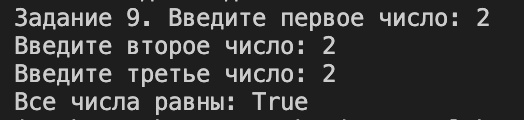

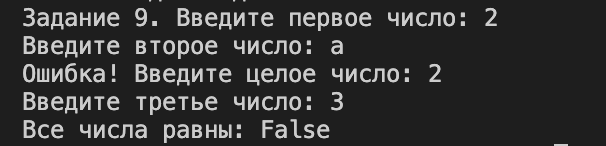

# Задание 2

## Задача 1

### Текст задачи

Дана сигнатура метода: public int abs (int x);

Необходимо реализовать метод таким образом, чтобы он возвращал модуль числа х (если оно было положительным, то таким и остается, если он было отрицательным – то необходимо вернуть его без знака минус).

Пример 1:

x=5

результат: 5

Пример 2:

x=-3

результат: 3

### Алгоритм решения

1. Получить число x.
2. Проверить, является ли число отрицательным.
3. Если число отрицательное, изменить его знак.
4. Вернуть полученное значение.

### Тестирование

---

## Задача 3

### Текст задачи

Дана сигнатура метода: public bool is35 (int x);

Необходимо реализовать метод таким образом, чтобы он возвращал true, если число x делится нацело на 3 или 5. При этом, если оно делится и на 3, и на 5, то вернуть надо false. Подсказка: оператор % позволяет получить остаток от деления.

Пример 1:

x=5

результат: true

Пример 2:

x=8

результат: false

Пример 3:

x=15

результат: false

### Алгоритм решения

1. Получить число x.
2. Проверить делимость числа на 3.
3. Проверить делимость числа на 5.
4. Если число делится только на одно из двух чисел, вернуть true.
5. Если число делится и на 3, и на 5 либо не делится ни на одно из них, вернуть false.

### Тестирование

---

## Задача 5

### Текст задачи

Дана сигнатура метода: public int max3 (int x, int y, int z);

Необходимо реализовать метод таким образом, чтобы он возвращал максимальное из трех полученных методом чисел. Подсказка: идеальное решение включает всего две инструкции if и не содержит вложенных if.

Пример 1:

x=5 y=7 z=7

результат: 7

Пример 2:

x=8 y=-1 z=4

результат: 8

### Алгоритм решения

1. Получить три числа x, y и z.
2. Принять x за максимальное значение.
3. Сравнить y с текущим максимумом.
4. Сравнить z с текущим максимумом.
5. Вернуть максимальное значение.

### Тестирование

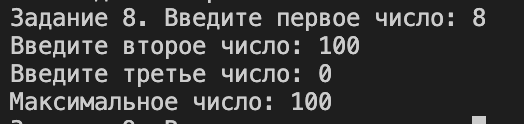

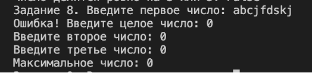

---

## Задача 7

### Текст задачи

Дана сигнатура метода: public int sum2 (int x, int y);

Необходимо реализовать метод таким образом, чтобы он возвращал сумму чисел x и y. Однако, если сумма попадает в диапазон от 10 до 19, то надо вернуть число 20.

Пример 1:

x=5 y=7

результат: 20

Пример 2:

x=8 y=-1

результат: 7

### Алгоритм решения

1. Получить числа x и y.
2. Вычислить их сумму.
3. Проверить, попадает ли сумма в диапазон от 10 до 19.
4. Если сумма находится в этом диапазоне, вернуть 20.
5. В противном случае вернуть сумму чисел.

### Тестирование

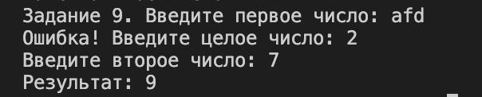

---

## Задача 9

### Текст задачи

Дана сигнатура метода: public String day (int x);

Метод принимает число x, обозначающее день недели. Необходимо реализовать метод таким образом, чтобы он возвращал строку, которая будет обозначать текущий день недели, где 1- это понедельник, а 7 – воскресенье. Если число не от 1 до 7 то верните текст “это не день недели”. Вместо if в данной задаче используйте switch.

Пример:

x=5

результат: “пятница”

### Алгоритм решения

1. Получить число x.
2. Использовать конструкцию switch.
3. Для значений от 1 до 7 определить соответствующий день недели.
4. Если значение не входит в диапазон от 1 до 7, вернуть текст «это не день недели».
5. Вернуть результат.

### Тестирование

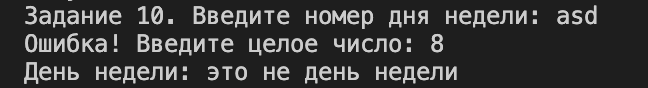

# Задание 3

## Задача 1

### Текст задачи

Дана сигнатура метода: public String listNums (int x);

Необходимо реализовать метод таким образом, чтобы он возвращал строку, в которой будут записаны все числа от 0 до x (включительно).

Пример:

x=5

результат: “0 1 2 3 4 5”

### Алгоритм решения

1. Получить число x.
2. Создать строку для хранения результата.
3. Последовательно перебрать числа от 0 до x.
4. Добавить каждое число в строку.
5. Вернуть полученную строку.

### Тестирование

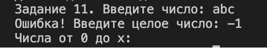

---

## Задача 3

### Текст задачи

Дана сигнатура метода: public String chet (int x);

Необходимо реализовать метод таким образом, чтобы он возвращал строку, в которой будут записаны все четные числа от 0 до x (включительно). Подсказа для обеспечения качества кода: инструкцию if использовать не следует.

Пример:

x=9

результат: “0 2 4 6 8”

### Алгоритм решения

1. Получить число x.
2. Создать строку для хранения результата.
3. Использовать цикл с шагом 2.
4. Последовательно добавлять чётные числа от 0 до x.
5. Вернуть полученную строку.

### Тестирование

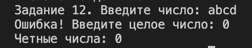

---

## Задача 5

### Текст задачи

Дана сигнатура метода: public int numLen (long x);

Необходимо реализовать метод таким образом, чтобы он возвращал количество знаков в числе x.

Подсказка:

Int у=123/10; // у будет иметь значение 12

Пример:

x=12567

результат: 5

### Алгоритм решения

1. Получить число x.
2. Создать счётчик количества знаков.
3. Последовательно делить число на 10.
4. После каждого деления увеличивать счётчик.
5. Вернуть количество знаков.

### Тестирование

---

## Задача 7

### Текст задачи

Дана сигнатура метода: public void square (int x);

Необходимо реализовать метод таким образом, чтобы он выводил на экран квадрат из символов ‘*’ размером х, у которого х символов в ряд и х символов в высоту.

Пример 1:

x=2

результат:

**
**

Пример 2:

x=4

результат:

****
****
****
****

### Алгоритм решения

1. Получить размер квадрата x.
2. С помощью внешнего цикла сформировать строки квадрата.
3. С помощью внутреннего цикла вывести x символов `*`.
4. Повторять действия до получения x строк.

### Тестирование

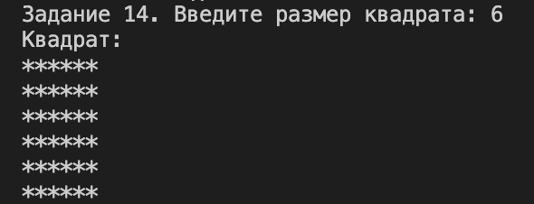

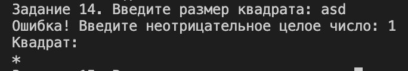

---

## Задача 9

### Текст задачи

Дана сигнатура метода: public void rightTriangle (int x);

Необходимо реализовать метод таким образом, чтобы он выводил на экран треугольник из символов ‘*’ у которого х символов в высоту, а количество символов в ряду совпадает с номером строки, при этом треугольник выровнен по правому краю. Подсказка: перед символами ‘*’ следует выводить необходимое количество пробелов.

Пример 1:

x=3

результат:

 *
 **
***

Пример 2:

x=4

результат:

 *
 **
 ***
****

### Алгоритм решения

1. Получить высоту треугольника x.
2. С помощью внешнего цикла сформировать строки треугольника.
3. Перед символами `*` вывести необходимое количество пробелов.
4. Вывести количество `*`, соответствующее номеру строки.
5. После каждой строки перейти на новую строку.

### Тестирование

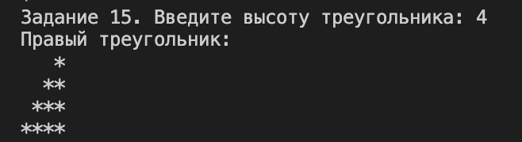

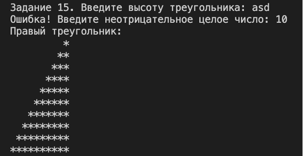

# Задание 4

## Задача 1

### Текст задачи

Дана сигнатура метода: public int findFirst (int[] arr, int x);

Необходимо реализовать метод таким образом, чтобы он возвращал индекс первого вхождения числа x в массив arr. Если число не входит в массив – возвращается -1.

Пример:

arr=[1,2,3,4,2,2,5]

x=2

результат: 1

### Алгоритм решения

1. Ввести массив arr и число x.
2. Последовательно перебрать элементы массива.
3. Сравнить каждый элемент с x.
4. При первом совпадении вернуть индекс этого элемента.
5. Если число не найдено, вернуть -1.

### Тестирование

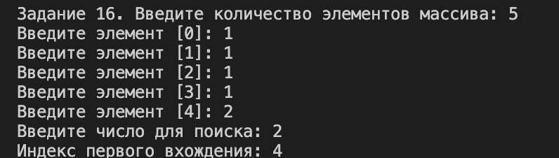

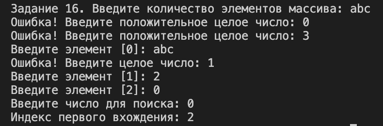

---

## Задача 3

### Текст задачи

Дана сигнатура метода: public int maxAbs (int[] arr);

Необходимо реализовать метод таким образом, чтобы он возвращал наибольшее по модулю (то есть без учета знака) значение массива arr.

Пример:

arr=[1,-2,-7,4,2,2,5]

результат: -7

### Алгоритм решения

1. Ввести массив arr.
2. Принять первый элемент массива за элемент с максимальным абсолютным значением.
3. Последовательно сравнить абсолютные значения остальных элементов с текущим максимумом.
4. Если абсолютное значение текущего элемента больше, сохранить этот элемент как новый максимум.
5. Вернуть найденный элемент.

### Тестирование

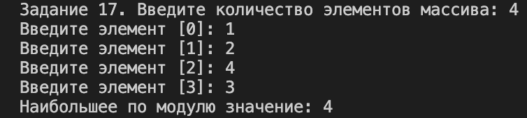

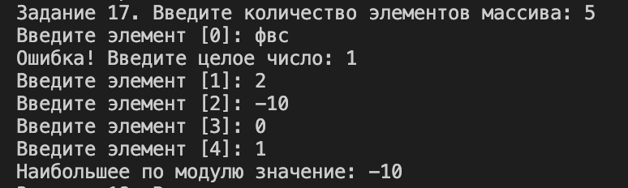

---

## Задача 5

### Текст задачи

Дана сигнатура метода: public int[] add (int[] arr, int[] ins, int pos);

Необходимо реализовать метод таким образом, чтобы он возвращал новый массив, который будет содержать все элементы массива arr, однако в позицию pos будут вставлены значения массива ins.

Пример:

arr=[1,2,3,4,5]

ins=[7,8,9]

pos=3

результат: [1,2,3,7,8,9,4,5]

### Алгоритм решения

1. Ввести массив arr, массив ins и позицию pos.
2. Создать новый массив размером, равным сумме размеров arr и ins.
3. Скопировать в новый массив элементы arr до позиции pos.
4. Вставить в новый массив элементы ins начиная с позиции pos.
5. Скопировать оставшиеся элементы arr.
6. Вернуть новый массив.

### Тестирование

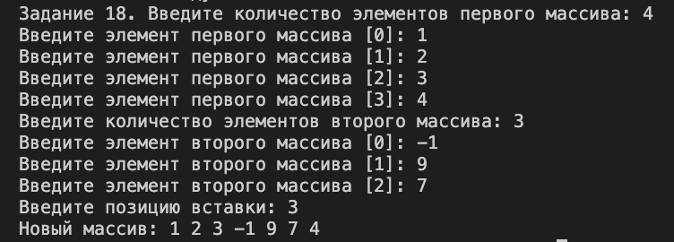

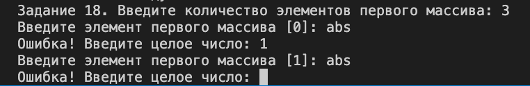

---

## Задача 7

### Текст задачи

Дана сигнатура метода: public int[] reverseBack (int[] arr);

Необходимо реализовать метод таким образом, чтобы он возвращал новый массив, в котором значения массива arr записаны задом наперед.

Пример:

arr=[1,2,3,4,5]

результат: [5,4,3,2,1]

### Алгоритм решения

1. Ввести массив arr.
2. Создать новый массив такого же размера.
3. Последовательно брать элементы исходного массива с конца и записывать их в новый массив с начала.
4. Вернуть новый массив.

### Тестирование

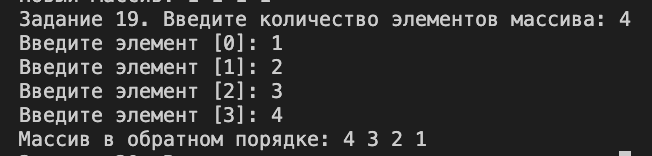

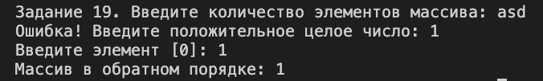

---

## Задача 9

### Текст задачи

Дана сигнатура метода: public int[] findAll (int[] arr, int x);

Необходимо реализовать метод таким образом, чтобы он возвращал новый массив, в котором записаны индексы всех вхождений числа x в массив arr.

Пример:

arr=[1,2,3,8,2,2,9]

x=2

результат: [1,4,5]

### Алгоритм решения

1. Ввести массив arr и число x.
2. Подсчитать количество элементов массива, равных x.
3. Создать новый массив нужного размера.
4. Повторно перебрать исходный массив.
5. Записать в новый массив индексы всех элементов, равных x.
6. Вернуть массив с найденными индексами.

### Тестирование

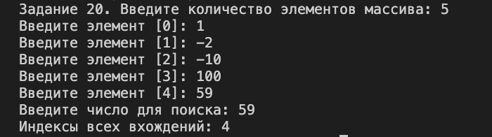

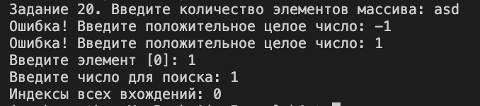
